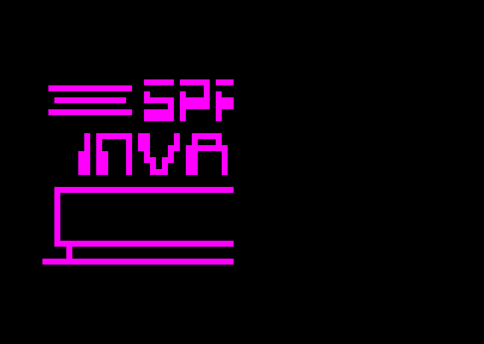
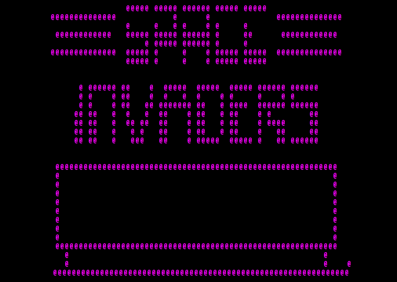
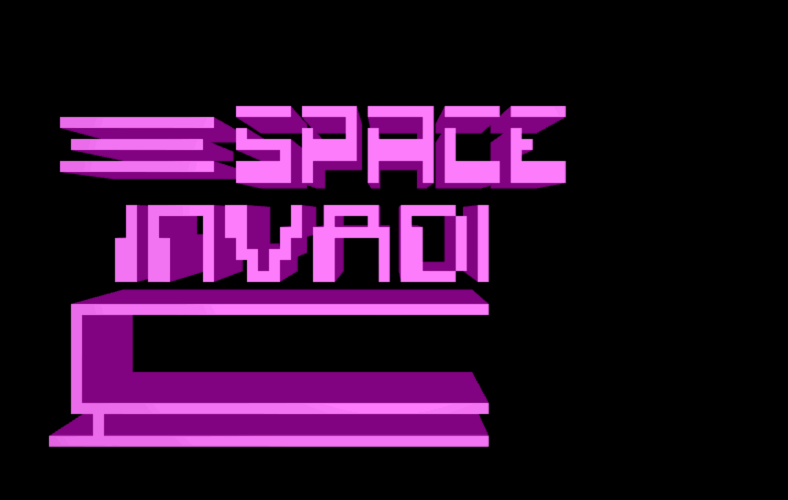

Chip-8-js
---
My first attempt to write an emulator.

## About CHIP-8
[CHIP-8](https://en.wikipedia.org/wiki/CHIP-8) is an interpreted programming language, developed by Joseph Weisbecker. It's consider an [easiest VM to emulate](https://news.ycombinator.com/item?id=6568569).


## Renderers

`Chip-8-js` supports three basic renderers:
### Pixel based 2d canvas


### HTML based ASCII renderer


### Voxel WebGL renderer with [Cervus](https://github.com/michalbe/cervus)


## Try me!
Try `Space invaders` game [online](https://michalbe.github.io/chip8-js/index.html). Controls:
  - `Q` Left
  - `W` Fire
  - `E` Right

## Moar roms
Download more public domain CHIP-8 games [here](https://www.zophar.net/pdroms/chip8.html)

## Run localy

```
npm i
npm run dev
```
and point your browser to http://localhost:10001. Renderers can be easily changed in `src/main.js`.

